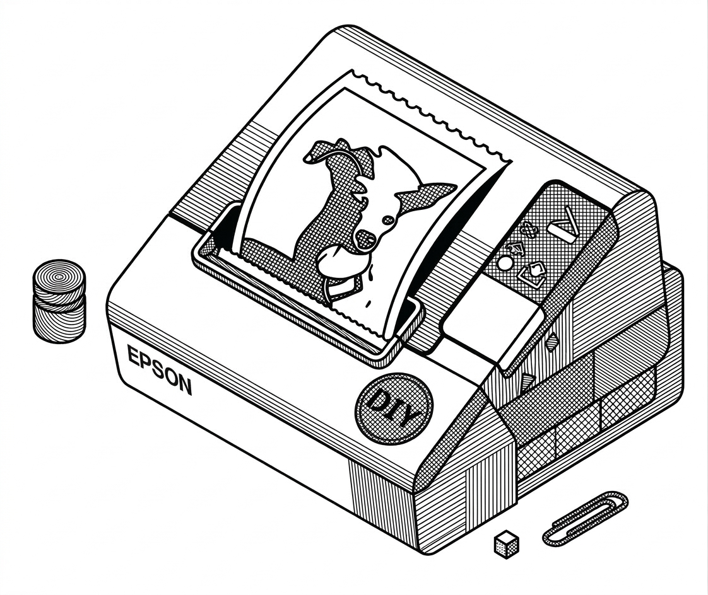

# tmt88v-print



Print PNG images to **Epson TM-T88V** thermal printer (80mm) via ESC/POS. Sends data **directly to the device** (e.g. `/dev/usb/lp2`), no CUPS/lp.

- Resolution: 512 dots (72mm printable width).
- 1-bit output: contrast stretch + threshold. **Dithering**: default `none`; use `--dither floyd-steinberg`, `ordered`, or `atkinson` for halftone.
- Chunked printing for tall images (default 400px strips); data is sent to the device in small chunks to avoid buffer overflow.

Written in **TypeScript**, compiles to JavaScript for npm.

## Install

```bash
npm install tmt88v-print
```

## CLI

```bash
# Print image to default device (/dev/usb/lp2)
npx tmt88v-print image.png

# Custom device
npx tmt88v-print image.png --device /dev/usb/lp0

# Save ESC/POS to file instead of printing
npx tmt88v-print image.png --output out.bin

# Chunk height (default 400)
npx tmt88v-print image.png --chunk 256

# Dithering: none (default), floyd-steinberg, ordered, atkinson
npx tmt88v-print image.png --dither floyd-steinberg
npx tmt88v-print image.png --dither ordered

# Width, fit, threshold
npx tmt88v-print image.png --width 512 --fit inside --threshold 128
```

If the device requires root, use the full path to `node` (e.g. with nvm, `sudo` does not see it):  
`sudo $(which node) $(which npx) tmt88v-print image.png`  
Or run from the built package: `sudo $(which node) dist/cli.js image.png`

## API

```ts
import { imageToEscpos, printImage } from 'tmt88v-print';
import * as fs from 'fs';

// Get ESC/POS buffer (options: width, fit, dither, threshold, chunkHeight)
const buffer = await imageToEscpos('image.png', {
  chunkHeight: 400,
  dither: 'floyd-steinberg', // 'none' | 'floyd-steinberg' | 'ordered' | 'atkinson'
  threshold: 128,
});
fs.writeFileSync('/dev/usb/lp2', buffer);

// Or print directly
await printImage('image.png', { device: '/dev/usb/lp2', chunkHeight: 400, dither: 'ordered' });
```

## Linux device

Printer is usually `/dev/usb/lp0`, `/dev/usb/lp1`, etc. Check with `ls /dev/usb/lp*`. Add yourself to group `lp` to avoid sudo: `sudo usermod -aG lp $USER` (then logout/login).

## Why chunked writing? (no handshake)

When printing to the device, data is sent in small chunks (e.g. 1 KB) with a short delay between chunks. There is **no handshake**: the app only writes to `/dev/usb/lp*`; the Linux `usblp` driver does not expose a “buffer ready” signal or reliable status readback. ESC/POS defines status commands (e.g. DLE EOT), but on USB they are typically not available to the application. So we use **fixed-rate throttling** (same chunk size and delay every time). It is deterministic: we never send more than X bytes per Y ms, which keeps the printer buffer from overflowing (avoids EIO) while keeping the stream smooth.

## Local testing (no printer)

Generate a sample image and write ESC/POS to a file:

```bash
npm run build
node examples/generate-sample.js
node dist/cli.js examples/sample.png --output examples/out.bin
```

See [examples/README.md](examples/README.md) for more options and API usage.

## Author

**Pietro Leoni** – [GitHub](https://github.com/piLeoni) · pietro.leoni@gmail.com

## License

MIT – see [LICENSE](LICENSE).
